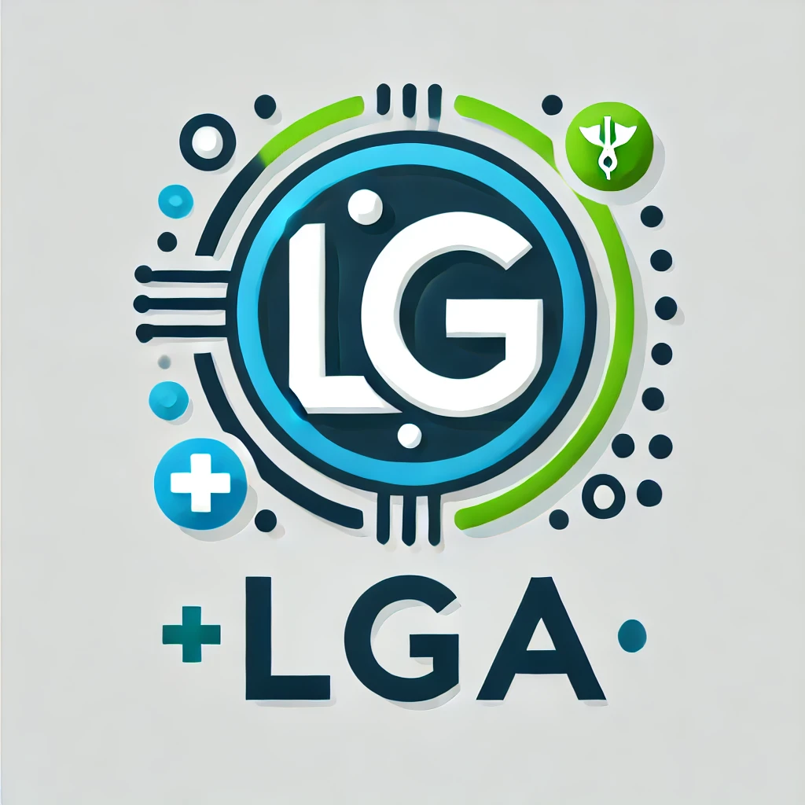

# 

# LGA: A Language Guide Adapter for Advancing the SAM Model's Capabilities in Medical Image Segmentation

This repository contains the code for our MICCAI 2024 accepted paper.

## Acknowledgements

We would like to express our gratitude to the following open-source projects and libraries that made this research possible:

- [Segment Anything Model (SAM)](https://github.com/facebookresearch/segment-anything)
- [LViT](https://github.com/HUANGLIZI/LViT)

The code for this project is available at [https://github.com/JiHooooo/LGA](https://github.com/JiHooooo/LGA).
